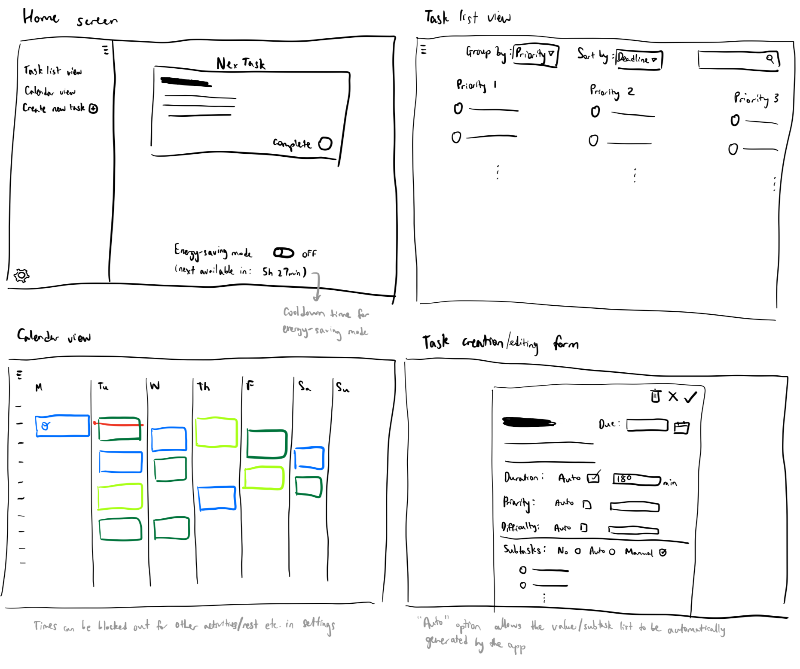

# Assignment 2
## Problem Statement
### Problem Domain
Balancing academics, extracurriculars and personal commitments can feel overwhelming, and I often find it difficult to decide what to work on at any given time. I’m interested in figuring out ways to better organize my time; however, spending time planning out my tasks takes away time to complete them, and I often face stress deciding what to work on at any given moment (especially when multiple tasks feel equally urgent). I'd like to make planning more structured and manageable, in order to stay on top of my tasks without burning out.

### Key Problem: Prioritizing tasks in the moment

When a student has multiple competing tasks (e.g. an urgent but low-weightage assignment due tomorrow, a high-weightage project due later in the week, a club responsibility, personal rest needs), it can be overwhelming to choose the "correct" thing to do next. This leads to wasted time, stress, and sometimes poor outcomes.

The difficulty is not just in scheduling a calendar but in real-time decision-making about prioritization. A system that helps with tasks prioritization based on many factors such as deadlines, estimated time needed and class/activity schedule would greatly reduce stress, time wasted and decision fatigue.

### Stakeholders
1. **Task-doer** - student or professional managing their workload, main user of the tool
2. **Collaborators** - people affected by the task-doer's productivity on group tasks, e.g. classmates, project teammates, club members
3. **Supervisors** - people who expect timely, quality results from the task-doers, often the ones who assigned the work, e.g. professors, managers, advisors

### Evidence
1. [Decision fatigue](https://en.wikipedia.org/wiki/Decision_fatigue): explains how making many decisions impairs cognitive self-control and persistence, reinforcing the need for support in prioritization
2. [Factors affecting ­individual task prioritisation in a workplace setting](https://pmc.ncbi.nlm.nih.gov/articles/PMC6502562/): a review showing that urgency, importance, task length and personal experience influence how people prioritize tasks, highlighting the complexity of the problem which provides opportunities for software assistance
3. [Decision Fatigue in ADHD](https://www.verywellmind.com/decision-fatigue-5215463): highlights that individuals with ADHD frequently experience mental exhaustion from daily decisions, even in mundane tasks; illustrtates broader relevance of task prioritization tools
4. [What Is Task Prioritization?](https://www.monitask.com/en/business-glossary/task-prioritization): presents common task prioritization techniques and pitfalls which could be the basis for new features to hedge against such pitfalls
5. [Why We Struggle to Prioritize](https://eleganthack.com/why-we-struggle-to-prioritize/): key reasons behind why it is difficult to prioritize tasks and strategies to overcome it
6. [Helping Students with Decision Fatigue](https://saotg.com/helping-students-with-decision-fatigue/): a coaching program that emphasizes building executive function, time management, and reducing decision load for students, demonstrating non-software approaches to the same problem

### Comparables
1. [Trello](https://trello.com): a web-based project management application employing a Kanban-style workflow for organizing and tracking projects
2. [Notion](https://www.notion.com/): AI workspace for organizing notes/projects/tasks
3. [Todoist](https://www.todoist.com/): to-do list app with checkboxes, due dates, reminders and priority assignments
4. [SkedPal](https://www.skedpal.com/): AI calendar that turns to-do lists into a personalized time-blocked schedule, showing demand for smart prioritization tools

## Application Pitch
Every day, students and professionals alike are faced with the same exhausting question: *what should I work on right now?* With deadlines piling up and projects of different sizes competing for attention, choosing the “right” task can feel just as stressful as actually doing the work. NexTask is designed to take that burden off your shoulders.

At its core, NexTask helps you decide what to do next. Instead of juggling calendars, sticky notes and endless to-do lists, you open the app and see clear recommendations tailored to your deadlines, goals, and state of mind.

The first feature, **Dynamic Task Ranking**, automatically organizes your tasks in real time. As new assignments come in or deadlines change, NexTask reprioritizes them instantly. For students, this means less time wasted debating and more time actually finishing work. For supervisors and collaborators, it means steadier, more reliable progress.

The second feature, **Smart Breakdowns**, takes large, intimidating assignments and splits them into manageable pieces. Instead of staring at “Write research paper,” you’ll see smaller steps like “Draft outline for research paper” or “Write introduction,” scheduled in a logical order. This not only reduces procrastination but also ensures supervisors and collaborators see more consistent updates along the way.

Finally, NexTask includes **Energy-saving Mode**, a simple toggle that adapts your task list to your current focus and energy level. If you're feeling drained after a long day, simply switch on Energy Mode, and NexTask will suggest lighter, lower-stakes tasks for the immmediate future so you can keep moving forward without burning out. For busy students or professionals, this means better balance and fewer late nights of wasted effort.

With NexTask, the decision fatigue of constant prioritization disappears. You’ll always know what’s most important, how to start and how to keep going. Stop stressing and guessing; start doing.

## Concept Design
### Concepts

**concept** Task[User]\
**purpose** each Task represents a unit of work that the user may need to complete\
**principle** a user may create a task, or it may be created as a subtask of another task by the user or the system. A task has attributes that can be used to schedule it/determine when it should be done.\
**state**\
&nbsp;&nbsp;a set of Tasks with\
&nbsp;&nbsp;&nbsp;&nbsp;an owner User\
&nbsp;&nbsp;&nbsp;&nbsp;a title String\
&nbsp;&nbsp;&nbsp;&nbsp;a description String\
&nbsp;&nbsp;&nbsp;&nbsp;a dueDate DateTime\
&nbsp;&nbsp;&nbsp;&nbsp;a duration Number\
&nbsp;&nbsp;&nbsp;&nbsp;a priority Number\
&nbsp;&nbsp;&nbsp;&nbsp;a difficulty Number\
&nbsp;&nbsp;&nbsp;&nbsp;a status of TODO, IN_PROGRESS or DONE\
**actions**\
&nbsp;&nbsp;createTask(user: User, title: String, description: String, dueDate: DateTime, duration: Number, priority: Number, difficulty: Number): (task: Task)\
&nbsp;&nbsp;&nbsp;&nbsp;**requires** user exists\
&nbsp;&nbsp;&nbsp;&nbsp;**effects** add a new Task to the set of Tasks with given attributes and status = TODO\
&nbsp;&nbsp;updateTask(task: Task, title?: String, dueDate?: DateTime, duration?: Number, priority?: Number, difficulty?: Number): (updatedTask: Task)\
&nbsp;&nbsp;&nbsp;&nbsp;**requires** task exists\
&nbsp;&nbsp;&nbsp;&nbsp;**effects** for each of the optional arguments, update the given task in the set of Tasks with the new value, then return the updated Task\
&nbsp;&nbsp;completeTask(task: Task): (void)\
&nbsp;&nbsp;&nbsp;&nbsp;**requires** task exists and its status = TODO or IN_PROGRESS\
&nbsp;&nbsp;&nbsp;&nbsp;**effects** set task.status to DONE\
&nbsp;&nbsp;progressTask(task: Task): (void)\
&nbsp;&nbsp;&nbsp;&nbsp;**requires** task exists and its status = TODO\
&nbsp;&nbsp;&nbsp;&nbsp;**effects** set task.status to IN_PROGRESS\
&nbsp;&nbsp;deleteTask(task: Task): (void)\
&nbsp;&nbsp;&nbsp;&nbsp;**requires** task exists\
&nbsp;&nbsp;&nbsp;&nbsp;**effects** delete the given task from the set of tasks\
&nbsp;&nbsp;getTasksOwnedBy(user: User): (tasks: set of Tasks)\
&nbsp;&nbsp;&nbsp;&nbsp;**requires** user exists\
&nbsp;&nbsp;&nbsp;&nbsp;**effects** return the set of all tasks such that task.owner = user

---

**concept** SubtaskBreakdown[Task]\
**purpose** allows a large, complex task to be decomposed into smaller subtasks; keeps track of parent-child task relations\
**principle** a user either requests to automatically generate subtasks for a task, or adds subtasks manually. Subtasks initially inherit attributes from their parent task but these can be changed as long as the due date does not go beyond the parent task due date\
**state**\
&nbsp;&nbsp;a Decomposed set of Tasks with\
&nbsp;&nbsp;&nbsp;&nbsp;an optional parent Task\
&nbsp;&nbsp;&nbsp;&nbsp;a children seq of Tasks\
&nbsp;&nbsp;&nbsp;&nbsp;a completedChildren Number\
**actions**\
&nbsp;&nbsp;autoBreakdown(task: Task): (children: set of Tasks)\
&nbsp;&nbsp;&nbsp;&nbsp;**requires** task does not exist in the Decomposed set, or it exists but task.children is empty\
&nbsp;&nbsp;&nbsp;&nbsp;**effects** if task is not in Decomposed, add it to Decomposed with unassigned parent. Automatically generate a sequence of subtasks (Tasks, created with the Task concept above) based on the given task's title, description and other attributes. set task.children to this sequence, then return this sequence\
&nbsp;&nbsp;addSubtask(task: Task, child: Task): (void)\
&nbsp;&nbsp;&nbsp;&nbsp;**requires** task exists in the Decp,[psed] set and child does not exist in task.children\
&nbsp;&nbsp;&nbsp;&nbsp;**effects** append child at the end of task.children\
&nbsp;&nbsp;reorderSubtasks(task: Task, newChildren: seq of Tasks): (void)\
&nbsp;&nbsp;&nbsp;&nbsp;**requires** task exists in the Decomposed set and newChildren is a permutation of task.children\
&nbsp;&nbsp;&nbsp;&nbsp;**effects** set task.children = newChildren\
&nbsp;&nbsp;incrementCompletedChildren(task: Task): (void)\
&nbsp;&nbsp;&nbsp;&nbsp;**requires** task exists in the Decomposed set with status = TODO or IN_PROGRESS, task.completedChildren < length of task.children\
&nbsp;&nbsp;&nbsp;&nbsp;**effects** increase task.completedChildren by 1\
&nbsp;&nbsp;decrementCompletedChildren(task: Task): (void)\
&nbsp;&nbsp;&nbsp;&nbsp;**requires** task exists in the Decomposed set with status = IN_PROGRESS or DONE, task.completedChildren > 0\
&nbsp;&nbsp;&nbsp;&nbsp;**effects** decrease task.completedChildren by 1\
&nbsp;&nbsp;isTaskLeaf(task: Task): (leaf: Boolean)\
&nbsp;&nbsp;&nbsp;&nbsp;**effects** return true if (task exists in the Decomposed set and task.children is empty), or if task does not exist in Decomposed; return false otherwise

---

**concept** TaskRanker[User, Task]\
**purpose** computes and maintains a prioritized ordering of a user’s tasks\
**principle** when a user adds, edits or completes a task, a ranked sequence of "leaf" subtasks (that is, a list of all the Tasks who have no children, in the order that the system recommends to complete them) is produced by using task attributes, subtask relations and user's energy state\
**state**\
&nbsp;&nbsp;a set of TaskRankers with\
&nbsp;&nbsp;&nbsp;&nbsp;an owner User\
&nbsp;&nbsp;&nbsp;&nbsp;a ranked seq of Tasks\
&nbsp;&nbsp;&nbsp;&nbsp;a lastUpdated DateTime\
**actions**\
&nbsp;&nbsp;getCurrentLeafTasks(user: User): (tasks: set of Tasks)\
&nbsp;&nbsp;&nbsp;&nbsp; **requires** user exists\
&nbsp;&nbsp;&nbsp;&nbsp; **effects** get the list of all tasks owned by this user with Task.getTasksOwnedBy(user), then for each task in that list, check whether SubtaskBreakdown.isTaskLeaf(task). Return the set of tasks for which the output of isTaskLeaf is true.\
&nbsp;&nbsp;computeRankings(user: User, currentEnergyState: Number): (changed: Boolean)\
&nbsp;&nbsp;&nbsp;&nbsp;**requires** user exists and one TaskRanker exists with ranker.owner = user\
&nbsp;&nbsp;&nbsp;&nbsp;**effects** set ranker.lastUpdated to the current time, and update ranker.ranked to a new ordering of the leaf tasks owned by the user (from TaskRanker.getCurrentLeafTasks(user)), based on the given currentEnergyState. Return true if and only if ranker.ranked changed from its previous value.\
&nbsp;&nbsp;getRankedTaskList(user: User): (tasks: seq of Tasks)\
&nbsp;&nbsp;&nbsp;&nbsp; **requires** user exists and one TaskRanker exists with ranker.owner = user\
&nbsp;&nbsp;&nbsp;&nbsp; **effects** returns ranker.ranked

---

**concept** EnergySavingMode[User]\
**purpose** adapts task ranking to the user’s current energy or focus level by temporarily prioritizing lighter, less demanding tasks\
**principle** users can manually toggle energy-saving mode. When enabled, rankings will temporarily de-emphasize high-effort tasks to help prevent burnout. Enabling this mode has a timeout until the user can next enable it.\
**state**\
&nbsp;&nbsp;a set of EnergySavingModes with\
&nbsp;&nbsp;&nbsp;&nbsp;a user User\
&nbsp;&nbsp;&nbsp;&nbsp;an enabled Boolean\
&nbsp;&nbsp;&nbsp;&nbsp;a lastEnabled DateTime\
**actions**\
&nbsp;&nbsp;toggleEnergyState(user: User): (enabled: Boolean)\
&nbsp;&nbsp;&nbsp;&nbsp;**requires** user exists and an EnergySaverMode mode exists such that mode.user = user; mode.enabled = true, or (mode.enabled = false and lastEnabled is no less than 6 hours ago)\
&nbsp;&nbsp;&nbsp;&nbsp;**effects** toggle mode.enabled (set it to true if it was false and vice versa); if it was previously false, set mode.lastEnabled to the current time; return new mode.enabled\
&nbsp;&nbsp;getCurrentEnergyState(user: User): (enabled: Boolean)\
&nbsp;&nbsp;&nbsp;&nbsp;**requires** user exists and an EnergySaverMode mode exists such that mode.user = user\
&nbsp;&nbsp;&nbsp;&nbsp;**effects** returns mode.enabled

---

**concept** ScheduleRankedTasks[User, Task]\
**purpose** allows the user’s ranked tasks to be assigned to calendar slots\
**principle** each user has a Schedule of their ranked tasks. Scheduling respects the order given by TaskRanker while also considering task attributes (due date, duration) and the user’s blocked times. The user will be able to view a calendar plan rather than just a ranked list.\
**state**\
&nbsp;&nbsp;a set of TimeIntervals each with\
&nbsp;&nbsp;&nbsp;&nbsp;a start DateTime\
&nbsp;&nbsp;&nbsp;&nbsp;an end DateTime\
&nbsp;&nbsp;an AssignedIntervals set of TimeIntervals each with\
&nbsp;&nbsp;&nbsp;&nbsp;a task Task\
&nbsp;&nbsp;a set of Schedules with\
&nbsp;&nbsp;&nbsp;&nbsp;an owner User\
&nbsp;&nbsp;&nbsp;&nbsp;an assigned set of AssignedIntervals\
&nbsp;&nbsp;&nbsp;&nbsp;a blocked set of TimeIntervals\
&nbsp;&nbsp;&nbsp;&nbsp;a lastUpdated DateTime\
**actions**\
&nbsp;&nbsp;assignTask(task: Task, start: DateTime, end: DateTime): (void)\
&nbsp;&nbsp;&nbsp;&nbsp;**requires** schedule exists in the set of Schedules with schedule.owner = task.owner; interval (start, end) does not overlap with any blocked interval in schedule.blocked or any AssignedInterval in schedule.assigned\
&nbsp;&nbsp;&nbsp;&nbsp;**effects** add a new AssignedInterval with task, start, end to schedule.assigned; set schedule.lastUpdated to current time\
&nbsp;&nbsp;unassignTask(task: Task): (void)\
&nbsp;&nbsp;&nbsp;&nbsp;**requires** schedule exists in the set of Schedules with schedule.owner = task.owner; task is assigned to some AssignedInterval in schedule.assigned\
&nbsp;&nbsp;&nbsp;&nbsp;**effects** remove the AssignedInterval for this task from schedule.assigned; set lastUpdated to current time\
&nbsp;&nbsp;blockTime(user: User, start: DateTime, end: DateTime): (void)\
&nbsp;&nbsp;&nbsp;&nbsp;**requires** user exists and schedule exists in the set of Schedules with schedule.owner = user; interval (start, end) does not overlap with any AssignedInterval in schedule.assigned\
&nbsp;&nbsp;&nbsp;&nbsp;**effects** add a TimeInterval (start, end) to blocked (if there is an overlap, merge the overlapping intervals); set lastUpdated to current time\
&nbsp;&nbsp;freeTime(user: User, start: DateTime, end: DateTime): (void)\
&nbsp;&nbsp;&nbsp;&nbsp;**requires** user exists and schedule exists in the set of Schedules with schedule.owner = user; interval (start, end) exists or is a subset of an interval in schedule.blocked\
&nbsp;&nbsp;&nbsp;&nbsp;**effects** if necessary, split the larger blocked interval into smaller blocked intervals to isolate the given (start, end) to be freed; remove the given (start, end) from schedule.blocked; set lastUpdated to current time\
&nbsp;&nbsp;scheduleRankedTasks(user: User): (valid: Boolean)\
&nbsp;&nbsp;&nbsp;&nbsp;**requires** user exists and schedule exists in the set of Schedules with schedule.owner = user\
&nbsp;&nbsp;&nbsp;&nbsp;**effects** get TaskRanker.getRankedTaskList(user); iterate over this list and for each task, assign it into the earliest available TimeInterval before its dueDate, avoiding blocked and already assigned intervals; update schedule.assigned accordingly; set lastUpdated to current time; return true if it was possible to fit all tasks before their due date and false otherwise

### Synchronizations
**sync** updateParentStatusOnComplete\
**when**\
&nbsp;&nbsp;Task.completeTask(task)\
**then**\
&nbsp;&nbsp;if task has a parent, Task.progressTask(parent) and SubtaskBreakdown.incrementCompletedChildren(parent)\
&nbsp;&nbsp;if task has children, for each child in task.children: Task.completeTask(child)

---

**sync** completeTaskWhenChildrenDone\
**when**\
&nbsp;&nbsp;SubtaskBreakdown.incrementCompletedChildren(task)\
**then**\
&nbsp;&nbsp;if task.completedChildren = length of task.children, Task.completeTask(task)

---

**sync** cascadeDeleteChildren\
**when**\
&nbsp;&nbsp;Task.deleteTask(task)\
**then**\
&nbsp;&nbsp;if task has children, for each child in task.children: Task.deleteTask(child)\
&nbsp;&nbsp;if task has a parent and parent.completedChildren = length of parent.children, Task.completeTask(parent)

---

**sync** rerankOnTaskCreate\
**when**\
&nbsp;&nbsp;Task.createTask(user, ...)\
**then**\
&nbsp;&nbsp;TaskRanker.computeRankings(user, EnergySavingMode.getCurrentEnergyState(user))

---

**sync** rerankOnTaskDelete\
**when**\
&nbsp;&nbsp;Task.deleteTask(task)\
**then**\
&nbsp;&nbsp;TaskRanker.computeRankings(task.owner, EnergySavingMode.getCurrentEnergyState(task.owner))

---

**sync** rerankOnTaskComplete\
**when**\
&nbsp;&nbsp;Task.completeTask(task)\
**then**\
&nbsp;&nbsp;TaskRanker.computeRankings(task.owner, EnergySavingMode.getCurrentEnergyState(task.owner))

---

**sync** rerankOnTaskUpdate\
**when**\
&nbsp;&nbsp;Task.updateTask(task, ...)\
**then**\
&nbsp;&nbsp;TaskRanker.computeRankings(task.owner, EnergySavingMode.getCurrentEnergyState(task.owner))

---

**sync** rescheduleOnRankingUpdate\
**when**\
&nbsp;&nbsp;TaskRanker.computeRankings(user, currentEnergyState): (changed)\
**then**\
&nbsp;&nbsp;if changed = true, ScheduleRankedTasks.scheduleRankedTasks(user)

---

**sync** createTaskRankerOnUserCreate\
**when**\
&nbsp;&nbsp;User.register(): (user)\
**then**\
&nbsp;&nbsp;TaskRanker.create(user)

---

**sync** recomputeOnEnergyChange\
**when**\
&nbsp;&nbsp;EnergySavingMode.toggleEnergyState(user)\
**then**\
&nbsp;&nbsp;TaskRanker.computeRankings(user, currentEnergyState)\

### Note
These concepts together form the backbone of how NexTask transforms the user's to-do list into a ranked schedule. The `Task[User]` concept provides the foundation by defining each unit of work with its attributes. The `SubtaskBreakdown[Task]` concept extends this by supporting relationships between parent and child tasks, allowing complex tasks to be broken down into smaller subtasks. Synchronizations ensure that progress flows naturally across the hierarchy: when subtasks are completed or deleted, their parent/child tasks are updated accordingly.

The `TaskRanker[User, Task]` concept ensures that users see their tasks in a clear order in which they should be completed, producing a prioritized sequence of the "leaf" tasks in the hierarchy, based on attributes. `TaskRanker` also helps the `ScheduleRankedTasks[User, Task]` concept to convert the ranking into a calendar plan that respects deadlines and blocked intervals. The `EnergySavingMode[User]` concept influences these rankings by temporarily scheduling lighter tasks first when the user signals low energy. Synchronizations connect these concepts so that a change in rank order triggers rescheduling of tasks, toggling energy-saving mode triggers a recomputation of rankings, and rankings also update when tasks are created, edited or deleted.

## UI Sketches

## User Journey
The user is a college student balancing multiple responsibilities: classes with upcoming deadlines, a group lab project and a club presentation. After classes one Tuesday afternoon, they sit down at their desk and feel an overwhelming wave of stress: everything feels urgent, but there isn’t enough time to do it all at once.

They open NexTask and land on the home screen wireframe, which immediately highlights a single clear recommendation for their next task: “Write outline for lab project.” This suggestion comes from the dynamic task ranking feature, which has weighed the urgency of tomorrow’s small assignments against the importance of the larger project. Relieved to have direction, the user gets started on the project outline.

After finishing the outline earlier than the predicted duration, the user checks it off in the app; the next task on the Home Screen changes. The user glances at the calendar view, which has adjusted to schedule the next task to begin after a 5-minute break instead of the timing based on the original duration.

Later in the evening, the user’s energy dips. Instead of pushing through and risking burnout, they taps the energy toggle on the Home Screen. The app shifts to suggest a lighter activity for the immediate future: “Draft three slides for the club meeting.” This allows the user to keep momentum without draining themselves fully.

Over the week, the user gets assigned a new essay project. They add it as a task in NexTask and select the checkbox to automatically split the long essay assignment into smaller steps like “Find sources,” “Write intro” or “Write body paragraphs.” Each subtask shows up in the calendar view, fitting neatly between classes, meetings and other tasks. By Friday, the user has made steady progress across all responsibilities instead of cramming at the last minute.

The outcome is a noticeable shift: instead of constant indecision and wasted time, the user feels more in control and less anxious. Their collaborators benefit from regular updates on the lab project, supervisors see timely progress, and the user has managed to balance everything without burning out. The problem of “what should I do right now?” has been replaced by confidence and clarity.
